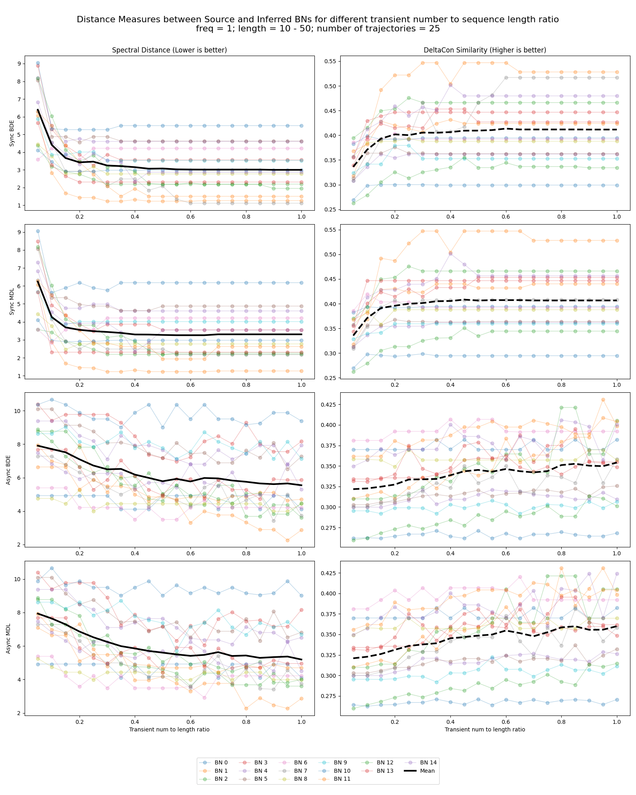
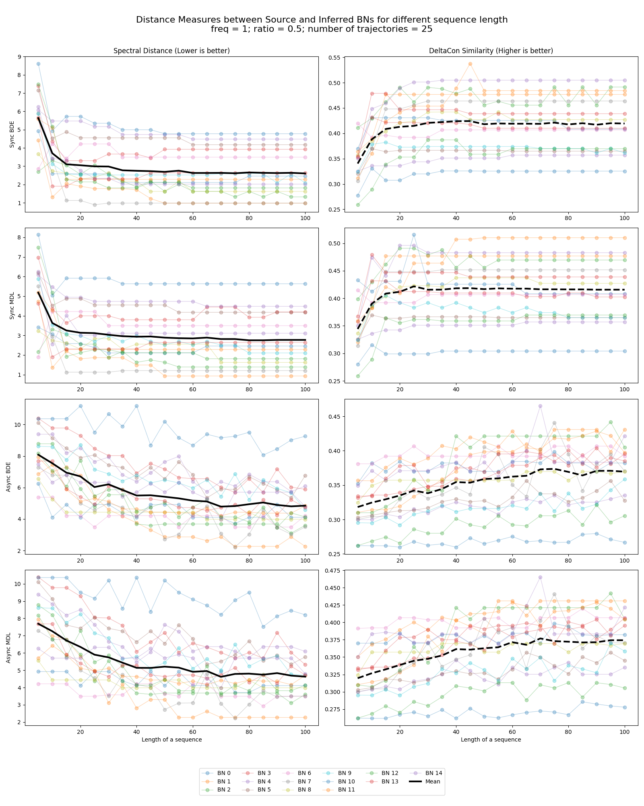
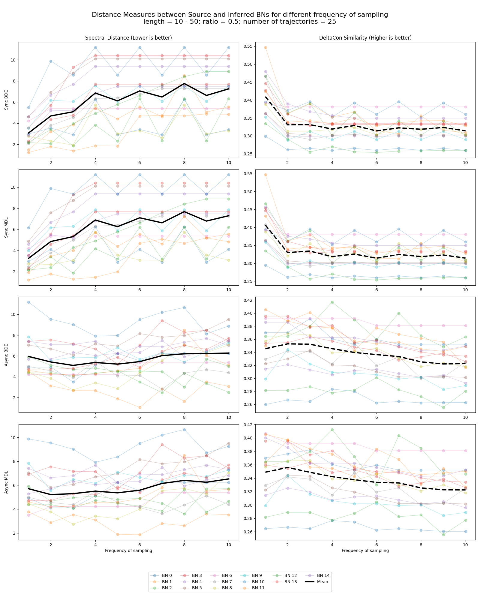

# __SDA 2 - Final Project - Report__

## Authors: Ignacy Kozakiewicz, Jakub Misiaszek, Joanna Mali, Piotr Maksymiuk

This is the report of the final project for Statistical Data Analysis 2 course (2025/26).
The task was to investigate how the type and amount of data describing network dynamics influence the accuracy 
of inferring network structure within the framework of Bayesian networks.

The first part of the project focuses on constructing various Boolean networks, simu-
lating them under asynchronous and synchronous update modes to generate data, using
the [BNFinder2](https://bioputer.mimuw.edu.pl/software/bnf/) software tool  to build dy-
namic Bayesian networks from the simulated data, and finally assessing the quality of the
reconstructed network structures.

In the second part of the project, the insights gained from the first part were be applied
to reconstruct the structure of a network model representing a real-life biological process.

Regarding the code used for performing the analysis, it is all published in a github repository 
under [this](https://github.com/zzox531/SDA_boolean_networks) link.

# __Prerequisites__

This project uses [`uv`](https://github.com/astral-sh/uv) for environment management and package installation.

To install all dependencies:
```bash
uv sync
```

To run a Python script within this environment:
```bash
uv run <script_name.py> [arguments]
```
# __Part I__

## __Subtask 1.__

The first task of the project was to construct several Boolean Networks
with sizes ranging from 5 to 16 nodes, where each node would have no more
than 3 parent nodes and the functions governing individual nodes should
be generated at random.

This functionality is provided by the ```bn_generator.py``` script. It's example usage is:

```sh
uv run bn_generator.py -s 2137 -c 5 -d datasets/bn_ --draw --draw-path ./visual
```

Arguments to be passed to the ```bn_generator.py``` are:

- `-s`/`--seed`: `(int)` -  a random seed to be set within the generator, such that the execution of the code is replicable
- `-c`/`--count`: `(int)` - number of boolean networks to be generated
- `-d`/`--ds-path`: `(str)` - dataset filename prefix. There'll be "\<bn_id\>.json" appended to the prefix in order to create ```count``` files, one for each of the boolean networks.  
- `--draw` - An option whether to generate visual representation of BNs. If set, saves the visuals for networks of size = 5 (higher numbers might be unreadable).
- `--draw-path`: `(str)`- A relative directory where the visual representations will be saved if `--draw` is set.

For each BN to be generated, the script samples a random number $N$ from 5 to 16 to be the number of nodes for the network. 

The variables names are set from `x0` up to `x15`.

After that, for each of the nodes $x_i$ and corresponding functions $f_i$ of the BN, the script:
- Generates a number $n_i$ of parent nodes of $x_i$
- Samples a set of parents $S_i$ of size $n_i$ from all the nodes using ```numpy.random.choice()``` (let's number variables within the set as $\{x_{1,S_i}, x_{2,S_i}, ... \}$)
- Generates $J = \{0, 1\}^{2^{n_i}}$ numbers between 0 and 1 and saves them inside a list. Those values serve as value table for transition function. (Let's call $K$ a set of such numbers $0 \leq k \leq 2^{n_i} - 1 $, that on index $k$, number $1$ was generated) 
- The logical clause is constructed using **disjunctive normal form**:

    Each index $k$ and corresponding value $j_k$ represent one row of the value table. $j$ is the result value and $k$ is a binary mask representing state of parent variables. For each true row (with $j_k = 1$) we create a clause $c_k$:

    We take the binary mask representation of parents' states $k$ and set of parents $S_i$. For each $TRUE$ parent node $l$ (represented by a lit $l$-th bit in $k$) we add to the clause $x_{l, S_i}$ and for each $FALSE$ parent node we add $\neg x_{l, S_i}$, all connected by $AND$ operators.

    For example - $n_i = 3, S_i = \{x_0, x_2, x_4\}, k = 5 = 101_2$. Clause $c_k = (x_0 \wedge \neg x_2 \wedge x_4)$. 

    We combine the entire clause with $OR$ operators like this: $C = c_{k_1} \vee c_{k_2} \vee ... \vee c_{k_m}$, where $k_0, k_1, ..., k_m \in JK$, $m = |K|$.

    We had to take under consideration such a case, where $|K| = 0$, where the **DNF** form returns an empty clause. In this case we simply take a logical $AND$ of all parents $x_{1, S_i}, ..., x_{n_i, S_i}$ (to later recall the parent set of a node) and $FALSE$ clause to force the function to always evaluate to 0.

After generating all the functions, the Boolean Network object is created.

The majority of the source code has been taken from the lab course about Boolean Networks, yet there were a few crucial components that had to be implemented, such as:

- ```get_neighbor_states_async(state)``` - Returns a list of neighbor states in asynchronous transition mode
- ```get_neighbor_state_sync(state)``` - Returns a neighbor state in synchronous transition mode
- ```get_attractors_async()``` Returns a list of sets of attractors in asynchronous transition mode
- ```get_attractors_sync()``` Returns a set of attractor states in synchronous transition mode
- ```is_attractor(state, synchronous)``` Returns ```TRUE``` if a state is an attractor in either synchronous or asynchronous mode.

The ```__init__()``` function has been extended not only store the functions / states of the BN, but also to compute important sets / dictionaries that will be used later on. These are:
- Set of asynchronous attractors - ```attractor_set_async```
- Set of synchronous attractors - ```attractor_set_sync```
- Dictionary of asynchronous parents for each state - ```parents_async```
- Dictionary of synchronous parents for each state - ```parents_sync```

These structures will be used while sampling trajectories from the boolean network.

The parents dictionaries are computed by going through each state $\mathcal{U}$ and computing a transition $\mathcal{U} \rightarrow \mathcal{V}$. For asynchronous transitions, there might be up to $N$ such elements, while for synchronous transitions, there's only one such $\mathcal{V}$. For each state $\mathcal{V}$, state $\mathcal{U}$ is considered its' parent. We store this information in the dictionary. 

the data about each of the boolean networks is stored inside ```ds_path<bn_id>.json```  directory.

An example of such a file format is:

```json
{
  "nodes": [
    "x0",
    "x1"
  ],
  "functions": [
    "(~x1)",
    "(~x0) | (x0)"
  ],
  "attrs_async": [
    "(0, 1)"
  ],
  "attrs_sync:": [
    "(0, 1)"
  ],
  "parents_async": {
    "(1, 0)": [
      "(0, 0)",
      "(1, 0)"
    ],
    "(0, 1)": [
      "(0, 0)",
      "(0, 1)",
      "(1, 1)"
    ],
    "(1, 1)": [
      "(1, 0)",
      "(1, 1)"
    ]
  },
  "parents_sync": {
    "(1, 1)": [
      "(0, 0)",
      "(1, 0)"
    ],
    "(0, 1)": [
      "(0, 1)",
      "(1, 1)"
    ]
  }
}
```

Even though such a file is quite big in terms of a single BN, saving the necessary data allows us to be able to refer to such data in $O(1)$ time, which greatly improves the efficiency of trajectory generation & BN inference. 

## __Subtask 2.__

Second subtask was to simulate trajectories of the generated networks in both synchronous and asynchronous modes to create datasets. This functionality is provided by the ```trajectory_generator.py``` python script. Its' example usage is: 

```sh
uv run trajectory_generator.py \
    -ratio-lo 0.2 \
    -ratio-hi 0.4 \
    -fr-lo 1 \
    -fr-hi 5 \
    -len-lo 10 \
    -len-hi 500 \
    -sync-no 100 \
    -async-no 100 \
    -bn-ds datasets/bn_ \
    -tg-ds datasets/test0_bn_ \
    -tg-ds-txt datasets/test0 \
    -lf logs/traj_gen.log \
    -s 42
```

Arguments to be passed to the trajectory_generator.py are:

- ```--ratio-lo``` / ```--trans-length-ratio-low```: (float) - Lower bound for the transient to trajectory length ratio

- ```--ratio-hi``` / ```--trans-length-ratio-high```: (float) - Upper bound for the transient to trajectory length ratio

- ```-fr-lo``` / ```--frequency-low```: (int) – Lower bound for the frequency used during trajectory generation.

- ```-fr-hi``` / ```--frequency-high```: (int) – Upper bound for the frequency used during trajectory generation.

- ```-len-lo``` / ```--trajectory-length-low```: (int) – Minimum length of each generated trajectory.

- ```-len-hi``` / ```--trajectory-length-high```: (int) – Maximum length of each generated trajectory.

- ```-sync-no``` / ```--synchronous-number```: (int) – Number of synchronous trajectories to generate per Boolean network.

- ```-async-no``` / ```--asynchronous-number```: (int) – Number of asynchronous trajectories to generate per Boolean network.

- ```-bn-ds``` / ```--bn-ds-filename```: (str) – Dataset filename prefix of boolean networks (.json format, generated by bn_generator). This prefix needs to be exactly the same as the one input for ```bn_generator.py```

- ```-tg-ds``` / ```--tg-ds-filename```: (str) – Trajectory dataset filename prefix for trajectories generation. For a filename ```datasets/bn_5.json```, if the prefix is ```datasets/test0_bn_``` a file ```datasets/test0_bn_5.json``` will be generated.

- ```-tg-ds-txt``` / ```--tg-ds-txt```: (str) – Filename prefix for exporting generated trajectories into text-based BNF files.

- ```-lf``` / ```--log-file```: (str) – Path to a log file where execution logs will be stored.

- ```-s``` / ```--seed```: (int) – Random seed to ensure reproducible trajectory generation.

### __General workflow__

The script takes as input a prefix of filenames to look for. It searches for all files starting with such a prefix and gets the list of datasets of Boolean Networks to be computed. For each network, it simulates a number of trajectories starting from random initial states. Each trajectory represents a sequence of Boolean states evolving according to the network’s update rules.

In the code, instead of using ratio of transient to attractor, we've used a ratio of transient to length. This allows the values to range from between 0 and 1, where for ```ratio=0``` we'd sample only attractor staes and for ```ratio=1``` we'd sample only transient states. 

The trajectories are generated with:

- randomly sampled transient/length ratio.
- randomly sampled trajectory lengths
- randomly sampled sampling frequencies
- either synchronous or asynchronous update dynamics.

The resulting trajectories are stored in two formats:

- A structured .json dataset containing metadata and state sequences.
- A set of .txt files (one per Boolean Network) formatted for BNFinder2 inference tool.

### __Trajectory generation__

For each Boolean Network $\mathrm{BN}$, trajectories are generated using the ```generate_trajectory``` function. 

### __Initial state__

- The initial state is sampled uniformly at random from $\{0,1\}^n$, where $n$ is the number of nodes in the network.

- Internally, states are represented as tuples of binary values and later converted to binary strings (e.g. ```"01011"```).

### __Update modes__

Two update schemes are supported:

- Synchronous update

    All nodes are updated simultaneously.

    Given a state $s_t$, the next state is computed as:

    $s_{t+1} = f(s_t)$

    where each node’s update function is evaluated using the same current state.

- Asynchronous update

    At each step, a single successor state is chosen at random from the set of all possible asynchronous updates, i.e. states where exactly one node has been updated according to its Boolean function.

The update mode is determined per trajectory based on whether it belongs to the synchronous or asynchronous subset.

### __Frequency-based sampling__

Each trajectory is generated step-by-step, but states are recorded only every $f$-th step, where:

$f \sim \mathcal{U}(\texttt{FrequencyLow}, \texttt{FrequencyHigh})$

Trajectory generation continues until the required number of recorded states reaches the randomly sampled trajectory length.

#### __Transient to length ratio__

There has been an issue with sampling trajectories which have a certain transient/length ratio while maintaining a trajectory length equal to some sampled value. As we randomly sample the initial state of the trajectory, it's hard to define which path leads to a certain ratio and a certain length (such path might not even exist). 

Our approach was to generate the trajectory and then to maximize the ratio by extending the trajectory. After the sample of length $l$ was created, we check what is the ratio of transient attractors to length $l$ of the trajectory. The states of the trajectory are $s_0, s_1, ..., s_l$. There might be two cases of the ratio:

- Trajectory to length ratio is too high 

    If it's too high, we sample state $s_{l+1}$ and set our sample to $s_{1}, ..., s_{l+1}$. If $s_{l+1}$ is an attractor, we improve the ratio. If it's not an attractor, we'll eventually reach a state $s_t$ which is an attractor and eventually improve the ratio. The ratio is improved because we increase the number of attractors by 1 and decrease number of transient states by 1 (as we cut away the prefix by 1 element). 
  
- Trajectory to length ratio is too low

    If the ratio is too low, we need to increase the number of transient states while decreasing the number of attractor states. We do this by extending our trajectory at the beginning. For the initial state $s_0$ we get its' parents and sample a parent $s_{-1}$. The new set is $s_{-1}, s_0, ..., s_{l-1}$. We repeat the process until conversion to the optimal ratio. There might be a case where the state has no parents, so we must stop the process, as we can't extend the trajectory anymore.

All of the generated trajectories are then saved within the .json files.

### __Trajectory dataset construction__

The function ```generate_trajectory_ds``` iterates over all Boolean Networks and generates for each network:

- ```synchronous_number``` synchronous trajectories
- ```asynchronous_number``` asynchronous trajectories

For every generated trajectory, the following information is stored:

- update mode (synchronous: ```true``` / ```false```)
- sampling frequency
- trajectory length
- list of recorded states (as binary strings)

The output dataset is saved in JSON format as specified by ```--tg-ds-filename```. Each entry in the dataset has the structure:

```json
{
  "bn_id": 0,
  "trajectories": [
    {
      "synchronous": true,
      "frequency": 1,
      "length": 17,
      "target_ratio": 0.20110442342472049,
      "generated_ratio": 0.17647058823529413,
      "states": ["0101", "1101", "1100", "..."]
    }
  ]
}
```

As you can see, the generated ratio does not always equal the target ratio. In some cases it's impossible to reach a target ratio of a certain value. As an example, suppose we're doing synchronous transitions for ```bn_size=5```, ```traj_len=100```, ```target_ratio = 0.8```. This would mean that in the trajectory, we want to have 80 transient and 20 attractor states samples. For BN of size ```bn_size=5```, there are $2^5 = 32$ possible state combinations, so in the most optimistic scenario, there would be 31 transient states and 1 attractor state. This would mean that for such a BN, the highest generated ratio would be ```0.31``` instead of ```0.8```. The larger the BN, the more probable it is to reach the target_ratio value, but for smaller BNs, the ```generated_ratio``` values might heavily deviate from what the ```target_ratio``` is.

### __Conversion to text-based format__

After generating the JSON dataset, the script converts the trajectories into text files using the ```convert_trajectories_to_txt``` function.

For each Boolean Network:

- One ```.txt``` file is created.
- Columns correspond to individual time points of individual trajectories.
- Rows correspond to network variables ($x_0$, $x_1$, ..., $x_n$).
- Each cell contains a binary value (```0``` or ```1```) representing the state of a variable at a given time step.

The output format is compatible with BNFinder2 inference tool.

The filenames follow the pattern: "```<tg-ds-txt>```\_bn\_```<bn_id>```\_trajectories.txt"

### __Reproducibility and logging__

- A fixed random seed (```--seed```) ensures reproducibility of trajectory generation.
- Detailed execution logs are written to the specified log file (```--log-file```), including:
    
    - initial and final states of trajectories
    - trajectory lengths and frequencies
    - progress over Boolean Networks

## __Subtask 3.__ 

The third subtask was to infer dynamic Bayesian Networks generated in substeps 1 and 2 using the BNFinder2 software tool. This functionality is provided by the ```trajectory_inference.sh``` bash script. 

The example usage for the script is: ```./trajectory_inferece.sh <output_prefix> <test_prefix> <scoring criterion: BDE | MDL>```

The script creates 3 subdirectories:
- ```./inference``` 
- ```./inference/sif```
- ```./inference/cpd```

The script finds all files within the ```./datasets``` subdirectory which match a regex: ```"${test_prefix}_bn_*_trajectories.txt"```

The files contain txt format of trajectories generated by the ```trajectory_generator.py``` script in substep 2.

The script takes out the id of the bn from the filename, e.g. for filename ```test_0_bn_5_trajectories.txt```, the id is ```5```.

The script infers the bayesian networks, saving its' output in 2 formats, saving the tests inside subdirectories created before. 

### __Scoring Criteria__

The script supports two scoring criteria for evaluating candidate network structures during inference:

- BDE (Bayesian Dirichlet Equivalent)
    A Bayesian scoring function that computes the marginal likelihood of the observed data given a network structure. It assumes a Dirichlet prior distribution over the network parameters and requires an equivalent sample size hyperparameter to control the strength of this prior. BDE is particularly useful when working with smaller datasets, as the prior helps regularize the learned structure.

- MDL (Minimum Description Length)
    An information-theoretic scoring function based on the principle of finding the most compact representation of the data. It balances model fit against complexity by penalizing structures that require more bits to encode. MDL does not require prior hyperparameters and is closely related to the Bayesian Information Criterion (BIC).

The whole pipeline of generating trajectories and infering the dynamic Bayesian Networks is provided by the ```perform_tests.sh``` bash script. This script executes the ```trajectory_inference.sh``` within its' logic.

This bash script is the main orchestration entry point for running a suite of inference experiments end-to-end. It automates the two core steps of the pipeline:

- Generate trajectory datasets by simulating the Boolean networks stored in ```datasets/bn_*.json```.

- Infer network structure from those trajectories using our inference wrapper (```trajectory_inference.sh```, which in turn calls BNFinder2).

The goal is to evaluate how the inferred Dynamic Bayesian Network structures depend on the type and amount of observed dynamics (synchronous vs asynchronous trajectories, and sample size).

### __Output format__

The BNFinder2 can output the inferred DBN in a couple of different formats. We decided to include two of them, `.sif` and `.cpd`, for visualization and for further analysis.

- SIF (Simple Interaction File) is the simplest and most compact format available. It only describes general interactions between variables inferred by the BNF2. Each row of the file looks like ```xi +/- xj``` and means that variable $x_i$ (parent) has positive or negative influence over variable $x_j$ (child). While not very informative, this format can be easily visualised on a graph. The graph is also much more readable than boolean network graph, which vertex count explodes exponentially.

- CPD file is ready python dictionary describing the inferred DBN. For each variable $x_i$ it contains a `<vertex dictionary>` in the following format:

```
<x_i> : {
  'vals' : <possible variable values, {0, 1} for BN>,
  'pars' : <list of parents of variable x_i>,
  'cpds' : <conditional probability distribution for x_i>
}
```

Field `'cpds'` contains a dictionary where each key is a list of values of parent variables, and value is another dictionary with probability distribution:

```
[0, 1, ..., 1] : {
  0 : <conditional probability for 0>,
  1 : <conditional probability for 1>
},
...
```

This format contains all information about inferred DBN and allows us to later measure the accuracy of the fit. At the same time, the out-of-the-box python dictionary can be easily imported into the script. Readable format was also helpful for interpretation of the results during the process.

### __Example usage__

```sh
./perform_tests.sh
```

This will create (if missing) the directories:

- datasets/ (trajectory outputs)
- logs/ (generator logs)
- inference/ (inference outputs)

and then execute the test for each config defined in the variable ```configs```.

Each experiment is specified as a single quoted line with the following fields:

```"ratio_lo ratio_hi fr_lo fr_hi len_lo len_hi sync_no async_no test_prefix seed criterion"```

These fields are parsed into variables and used to construct the generator command, inference command, and output paths. Since configs is a plain Bash array, the number of experiments is not fixed: the user can add any number of entries, remove entries, or adjust parameters to create new test regimes.

### __Meaning of each field__

- ```ratio_lo```,```ratio_hi```

   Lower/uppoer bound for the transient to trajectory length ratio

- ```fr_lo```, ```fr_hi```

    Lower/upper bound for the sampling frequency used when recording states from the simulated dynamics.

- ```len_lo```, ```len_hi```

    Lower/upper bound for the trajectory length. Each generated trajectory length is sampled within this range.

- ```sync_no```

    Number of synchronous-update trajectories generated per Boolean network.

- ```async_no```

    Number of asynchronous-update trajectories generated per Boolean network.

- ```test_prefix```

    Prefix used to namespace all artifacts of the run (datasets, logs, inference outputs). This should be unique per experiment to avoid overwriting results.

- ```seed```

    RNG seed used during trajectory generation to ensure reproducibility.

- ```criterion```

    Scoring criterion passed to BNFinder2 during inference (e.g., BDE / MDL).

### __Per-experiment execution__

1) Directory creation

    For each configuration, the script derives a set of paths:

    - ```tg_json="datasets/${test_prefix}_trajectory_samples.json"```: JSON dataset of all generated trajectories

    - ```log_file="logs/traj_gen_${test_prefix}.log"```: generator log

    - ```out_prefix="inference/${test_prefix}"```: output namespace for inference results (used by the inference wrapper)

2) Trajetory generation
    
    The script calls:
    ```sh
    python3 trajectory_generator.py \
        -ratio-lo <ratio_lo> -ratio-hi <ratio_hi> \
        -fr-lo <fr_lo> -fr-hi <fr_hi> \
        -len-lo <len_lo> -len-hi <len_hi> \
        -sync-no <sync_no> -async-no <async_no> \
        -bn-ds datasets/bn_ \
        -tg-ds datasets/<test_prefix> \
        -tg-ds-txt datasets/<test_prefix> \
        -lf logs/traj_gen_<test_prefix>.log \
        -s <seed>
    ```

    This step produces the trajectories, as described before.

3) Inference (```trajectory_inference.sh```)

    After generating the trajectories, the script runs:

    ```sh
    ./trajectory_inference.sh "<test_prefix>" "<test_prefix>" "<criterion>"
    ```

## __Subtask 4.__
The final task of the first part was to evaluate the quality of the network reconstruction. 
We compared the structure of the inferred Dynamic Bayesian Networks against the original ground truth Boolean networks to measure how different dataset characteristics influence inference accuracy.

This comparision was achived using `measure_distance.py` python script. Its' example usage is: 

```sh
uv run measure_distance.py \
    -bn-pref "datasets/bn_" \
    -infer-dir "inference/cpd/" \
    -t "ratio"
```

Arguments to be passed to the trajectory_generator.py are:

- ```-bn-pref```  / ```--bn-files-prefix```  (str) - File path prefix to source BNs

- ```-infer-dir```  / ```--inference-dir```  (str) - Directory name for inferenced DBNs

- ```-t```  / ```--test-name```  (str) - Test name to filter BNs, all by default

The script expects inferenced networks to be named in the format: 
```<test_name>-<test_value>-<sync|async>-<BDE|MDL>-<bn_id>.cpd```
Where:
- ```<test_name>``` is either ```ratio``` or ```len``` or other depending on the test
- ```<test_value>``` is a numeric value representing either trajectory length or transient/length ratio depending on the test
- ```<sync|async>``` indicates whether the trajectories used for inference were generated in synchronous or asynchronous mode
- ```<BDE|MDL>``` indicates the scoring criterion used during inference
- ```<bn_id>``` corresponds to the id of the boolean network stored in ```<bn-pref><bn_id>.json```

This script will save the resulting plots under ```imgs/<test_name>.png``` path.
The plots will contain 8 subplots - 4 for Spectral Distance (first column) and 4 for DeltaCon Similarity (second column).
The rows will represent:
1. Scoring Criterion: BDE and Synchronous Update Mode
2. Scoring Criterion: MDL and Synchronous Update Mode
3. Scoring Criterion: BDE and Asynchronous Update Mode
4. Scoring Criterion: MDL and Asynchronous Update Mode


Our analysis of the simulation data yielded several key insights regarding the inference process:
1. **Scoring Criteria (MDL vs. BDE)**
We compared the networks reconstructed using Minimal Description Length (MDL) and Bayesian-Dirichlet equivalence (BDE) scoring functions.
There was negligible difference in reconstruction accuracy between the two criteria. For the majority of the Boolean networks tested, both scoring functions converged to structures with nearly identical similarity.

2. **Update Modes (Synchronous vs. Asynchronous)**
We analyzed how the update mode of the training data affects the ability of BNFinder2 to recover the true structure. As predicted, networks inferred from Synchronous data were significantly more similar to the ground truth than those inferred from Asynchronous data. Synchronous transitions provide deterministic state pairs ($S_t \rightarrow S_{t+1}$) which simplify the learning of dependencies compared to the stochastic nature of asynchronous updates.

3. **Impact of Trajectory Length**
We tested the relationship between the length of the simulation trajectories (amount of data) and the accuracy of the result.
While accuracy generally improves with longer sequences, we observed a "saturation point" at approximately 100 time steps. Beyond this length, the marginal improvement in similarity scores diminished significantly. For synchronous data specifically, the inferred network structure stabilized relatively quickly and showed no structure change with trajectory length.

4. **Transient-to-Length Ratio**
We investigated the optimal proportion of transient states versus attractor states in the training data.
The highest reconstruction accuracy was consistently observed when the ratio of transient states to total sequence length was between 0.2 and 0.4.
Ratios significantly lower than this range (dominated by attractors) likely resulted in overfitting to steady states.
Ratios significantly higher (dominated by transients) failed to provide enough repeated patterns for the probabilistic model to solidify.

### Evaluation Methodology
To measure the similarity between the Ground Truth ($G_{GT}$) and Inferred ($G_{INF}$) networks, we implemented two structure-based graph distance measures:
- **Spectral Distance:** Calculated as the Euclidean distance between the sorted eigenvalues of the Laplacian matrices of the two graphs.
  - This metric evaluates the global topological similarity of the networks. By comparing graph spectra, we assess whether the inferred network preserves the overall structural properties (such as connectivity patterns and complexity) of the original system, even if specific node labels or local edges vary.
- **DeltaCon Similarity:** A measure of the similarity in information flow (affinity) between the graphs. 
  - This metric assesses functional connectivity rather than just structural overlap. DeltaCon analyzes how influence propagates through the network; if a direct edge is missing but a strong alternative path exists (preserving the flow of information), DeltaCon penalizes the error less than if a critical pathway is severed. This is particularly valuable for biological networks where redundancy is common.

### Results & Observations
The plots generated by the script illustrate how different factors impact the accuracy of network reconstruction.
Those plots are shown below:




Our analysis of the simulation data yielded several key insights regarding the inference process:

1. **Scoring Criteria (MDL vs. BDE)**
We compared the networks reconstructed using Minimal Description Length (MDL) and Bayesian-Dirichlet equivalence (BDE) scoring functions. There was negligible difference in reconstruction accuracy between the two criteria. For the majority of the Boolean networks tested, both scoring functions converged to structures with nearly identical similarity.

2. **Update Modes (Synchronous vs. Asynchronous)**
We analyzed how the update mode of the training data affects the ability of BNFinder2 to recover the true structure. As predicted, networks inferred from Synchronous data were significantly more similar to the ground truth than those inferred from Asynchronous data. Synchronous transitions provide deterministic state pairs ($S_t \rightarrow S_{t+1}$) which simplify the learning of dependencies compared to the stochastic nature of asynchronous updates.
3. **Impact of Trajectory Length**
We tested the relationship between the length of the simulation trajectories (amount of data) and the accuracy of the result. While accuracy generally improves with longer sequences, we observed a "saturation point" at approximately 40 time steps for synchronous updates. Beyond this length, the marginal improvement in similarity scores diminished significantly. For synchronous data specifically, the inferred network structure stabilized relatively quickly and showed no structure change with trajectory length.
4. **Transient-to-Length Ratio**
We investigated the optimal proportion of transient states versus attractor states in the training data.Generally, a higher proportion of transient states correlates with better reconstruction accuracy. Transient states provide unique state transitions that expose the underlying logic of the network, whereas attractors (repeating cycles) provide redundant information. While our plots suggest "the higher, the better," we encountered practical limitations in generating trajectories with extremely high transient ratios (>0.8). In these ranges, it becomes algorithmically difficult to avoid falling into an attractor, meaning the effective ratio in those datasets was likely lower than the target. This explains why the performance gain plateaus or behaves inconsistently at the extreme high end. We found that ratios between 0.3 and 0.6 consistently yielded strong reconstruction performance.
5. ** Impact of Sampling Frequency**
We analyzed the effect of the sampling interval (frequency) on inference quality. As the sampling interval increases (sampling every $k$-th step where $k > 1$), the reconstruction accuracy drops significantly.Bayesian Network inference relies on detecting direct causal dependencies between $S_t$ and $S_{t+1}$. When we skip steps (e.g., $S_t \rightarrow S_{t+2}$), we lose the immediate state transitions that define the network's logic. The algorithm tries to infer direct links from indirect relationships, leading to false positives (direct edges where a path should exist) or missed connections.

### Division of work
- Jakub Misiaszek:
    - Boolean Network generation framework (```bn_generator.py```)
    - Experiments with Boolean Network distance metrics (```distance_measure.py```)
    - Research on BNFinder2 saving formats, interpretation of such formats
- Ignacy Kozakiewicz:
    - BN Trajectory generation framework (```trajectory_generator.py```)
    - ```perform_tests.sh``` & ```trajectory_inference.sh```  pipelines for effective testing & BN inferring
    - Work on efficiency & time complexity of implemented inferring solutions.
- Piotr Maksymiuk:
    - Creating test cases for trajectory generation
    - Research and implementation of Spectral Distance & DeltaCon similarity (```distance_measure.py```)
    - Analysis of inferred Boolean Networks
- Joanna Mali:
    - Research on ready-to-go BN datasets, picking an appropriate one
    - Parsing the dataset into a proper .json format
    - Inference of the picked dataset (```chicken_test.sh```)
    - Analysis of the inference results

Each contributor described their part within the report. 